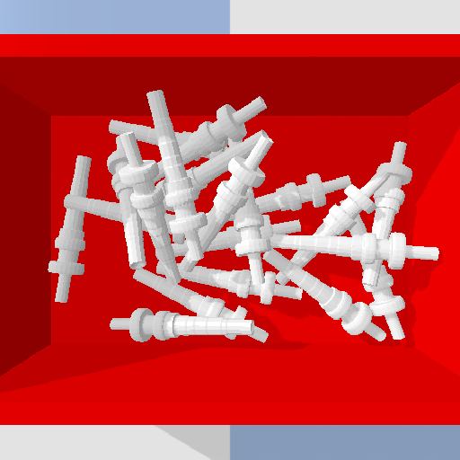
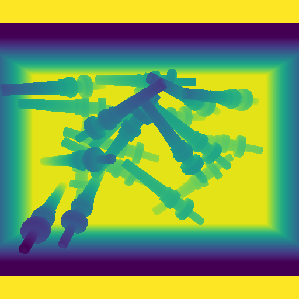
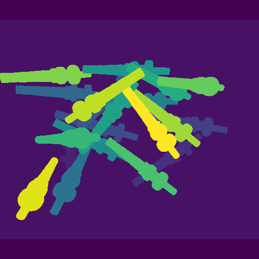
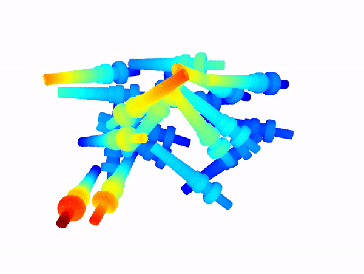
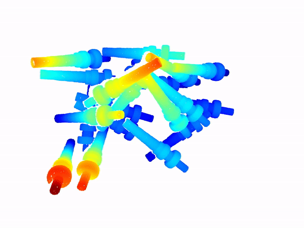

# Bin Picking Dataset Generation Environment
The scripts uses Pybullet and Open3D to create virtual clutter bin scenario dataset (rbg, depth, segmentation, point cloud) for AI training  

# Dependencies
- Open3D
- Pybullet

# Steps to run and collect data

All 3 scripts mentioned below will use the predefined setting to generate dataset and folders.  
You might need to change the generation parameters in `data_generation_setting.json` 

1. Launch Pybullet to drop items
    > python 1_pybullet_create_n_collect.py 
    
    This step will:
    - create pybullet virtual scene with a bin
    - drop N x item(s)
    - record the item poses 
    - record the image (rgb,depth,segmatation) 
    - clear the scene and repeat with N+1 until maximum limit

2. Use Open3d to reconstruct the full scene 
    > python 2_open3d_reconstruct_pcd_scene.py 

    This step will:
    - reconstruct the full scene base on the item poses record in step 1
    - compute the center scores based on the object model for each points
    - record and save the point cloud data with center score and segment index  

3. Filter reconstructed data based on camera FoV  
    > python 3_generate_pcd_fov_points.py 

    This step will:
    - Filter the full scene point cloud data ((remove blocked points ) based on camera pose
    - save the filtered data into `.H5` format

# Example on the captured data 

# About Object Model
Model preparation:  
1. Get your model in `.obj` format
2. Convert `.obj` with refine collision model ( change the path folder inside the script)  
    > run util/convert_obj_convexhull.py   
3. Follow other model template to create a `.urdf` model  

**Note:** make sure the object generate from `.urdf` is having the same orientation as the orientation from `.obj`

# Acknowledgemets
Thanks for [YaJun](https://github.com/xyjbaal) for providing the initial code for this development.

The Gear and Ring model included in this repo is from IPA Dataset [learn more](https://www.bin-picking.ai/)

The dataset is generate and recorded base on the steps mentioned in IPA Dataset.
